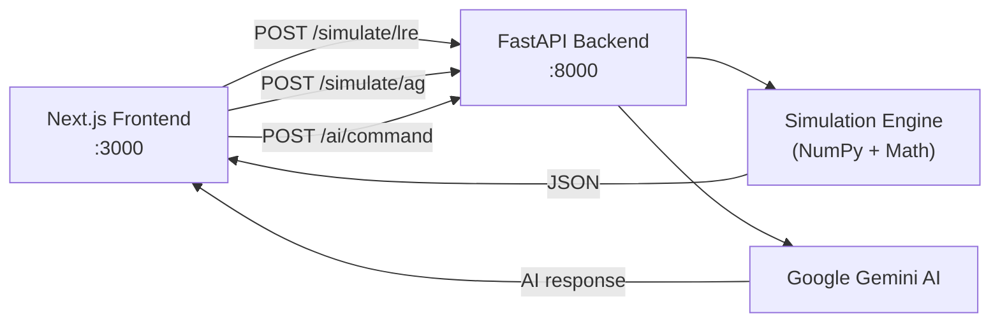

<div align="center">

# 🚀 Rocket Engine Simulation Lab

**A highly customizable Liquid Rocket Engine design suite & theoretical Antigravity propulsion simulator.**

Built with **Next.js 16** · **FastAPI** · **NumPy** · **Recharts** · **Google Gemini AI**

[](https://nextjs.org/)
[](https://fastapi.tiangolo.com/)
[](https://python.org/)
[](https://tailwindcss.com/)
[](LICENSE)

[Quick Start](#-quick-start) · [Features](#-features) · [Architecture](#-architecture) · [API Docs](#-api-reference) · [Contributing](#-contributing)

</div>

---

## 📖 Overview

A full-stack web application for designing, configuring, and simulating rocket engines in real time. Two operating modes cover both real-world and speculative propulsion research:

| Mode | What You Get |
|:----:|:-------------|
| 🔧 **Traditional LRE** | Design liquid rocket engines with real thermodynamic equations — adjust propellants, chamber pressure, expansion ratio, combustion cycle, and altitude. Watch Isp, mass flow, and nozzle geometry update instantly. |
| 🌀 **Antigravity** | Explore theoretical quantum propulsion — tune graviton flux, Casimir pressure, field intensity, spacetime permittivity, and power sources to model hypothetical lift forces and warp factors. |

An integrated **Google Gemini AI** assistant provides real-time design optimizations, material recommendations, and safety checklists — acting as your on-demand senior propulsion engineer.

---

## ✨ Features

<table>
<tr>
<td width="50%">

### 🔧 Traditional LRE Parameters
- **Propellant** — LOX/RP-1, LH2/LOX, CH4/LOX, Hydrazine/NTO
- **Combustion Cycle** — Gas Generator · Staged Combustion
- **Target Thrust** — 100 – 5,000 N
- **Chamber Pressure** — 10 – 150 Bar
- **Expansion Ratio** — 2 – 100
- **Altitude** — 0 – 50,000 m

</td>
<td width="50%">

### 🌀 Antigravity Parameters
- **Field Geometry** — Toroidal · Spherical · Cylindrical
- **Power Source** — Cold Fusion · Antimatter Plasma
- **Graviton Flux** — 100 – 2,000 THz
- **Field Intensity** — 0 – 5 T
- **Casimir Pressure** — 0 – 100 nN
- **Spacetime Permittivity** — 0.1 – 2.0

</td>
</tr>
</table>

**Real-Time Visualization** — Live Recharts telemetry, dynamic SVG cross-sections that morph with expansion ratio, animated quantum core visualizer.

**AI Engineering Assistant** — Design optimization (3 targeted suggestions), theoretical materials advisor, free-form propulsion engineering chat.

---

## 🏗 Architecture

```
rocket-engine-lab/
├── backend/                    # Python FastAPI server
│   ├── main.py                 # API routes & Gemini AI integration
│   ├── models.py               # Pydantic schemas
│   └── simulation.py           # Thermodynamic & quantum physics engine
├── frontend/                   # Next.js 16 (App Router)
│   └── src/
│       ├── app/
│       │   ├── page.tsx        # Main dashboard (client component)
│       │   ├── layout.tsx      # Root layout
│       │   └── globals.css     # Global styles
│       └── lib/utils.ts        # Tailwind merge utility
├── Google Gemini.pdf           # Design document & engineering report
├── The-LRE-Engine-Lab.txt      # Original prototype source
└── README.md
```



---

## 🔬 Physics

### De Laval Nozzle Thermodynamics (Traditional LRE)

| Symbol | Equation | Description |
|:------:|----------|-------------|
| **c\*** | `√(R·Tc/γ) × (2/(γ+1))^(-(γ+1)/(2(γ-1)))` | Characteristic velocity |
| **Cf** | `√((2γ²/(γ-1)) × (2/(γ+1))^((γ+1)/(γ-1)) × (1-(Pa/Pc)^((γ-1)/γ)))` | Thrust coefficient |
| **Isp** | `(c* × Cf) / g₀` | Specific impulse |
| **ṁ** | `F / (Isp × g₀)` | Mass flow rate |
| **At** | `(ṁ × c*) / Pc` | Throat area |
| **Pa** | `101325 × e^(-g·M·h / (R*·T))` | Altitude-adjusted ambient pressure |

> **Note:** Gas Generator cycle applies a **5% Isp penalty** vs. Staged Combustion.

Each propellant has unique thermodynamic constants:

| Propellant | γ | R (J/kg·K) | Tc (K) |
|:----------:|:---:|:----------:|:------:|
| LOX/RP-1 | 1.22 | 300 | 3500 |
| LH2/LOX | 1.20 | 500 | 3300 |
| CH4/LOX | 1.21 | 350 | 3400 |
| N2H4/NTO | 1.24 | 310 | 3200 |

### Theoretical Quantum Fields (Antigravity)

| Output | Model |
|--------|-------|
| **Lift Force** | `Flux × Intensity × 1.5 × geometry_mod × power_mod` |
| **Mass Reduction** | `min(Intensity × Permittivity × 0.5, 99.9%)` |
| **Warp Factor** | `log₁₀(Flux) × Intensity × (Permittivity / 100)` |

---

## ⚡ Quick Start

### Prerequisites

| Tool | Version | Link |
|------|---------|------|
| Python | 3.10+ | [python.org](https://www.python.org/downloads/) |
| Node.js | 18+ | [nodejs.org](https://nodejs.org/) |
| Git | Latest | [git-scm.com](https://git-scm.com/) |

> **Optional:** A [Google Gemini API Key](https://aistudio.google.com/apikey) for the AI features. The simulation works without one.

### 1 · Clone

```bash
git clone https://github.com/Souvik-Ghost/rocket-engine-lab.git
cd rocket-engine-lab
```

### 2 · Backend (Terminal 1)

```bash
cd backend
python -m venv venv

# Windows
.\venv\Scripts\activate
# macOS / Linux
source venv/bin/activate

pip install fastapi uvicorn pydantic numpy google-generativeai
python main.py
```

→ API running at **http://localhost:8000** &nbsp;|&nbsp; Swagger docs at **http://localhost:8000/docs**

### 3 · Frontend (Terminal 2)

```bash
cd frontend
npm install
npm run dev
```

→ Dashboard live at **http://localhost:3000**

---

## 🎮 Usage

| Action | How |
|--------|-----|
| **Switch modes** | Click the **Traditional / Antigravity** toggle in the sidebar — UI, colors, charts, and parameters all adapt. |
| **Tune parameters** | Use dropdowns for propellant/cycle/geometry and sliders for continuous values. Simulation **auto-recalculates** on every change. |
| **Read results** | Header bar shows key metrics. Charts show simulated telemetry. SVG visualizer updates geometry live. |
| **Use AI** | Paste your Gemini API key in the sidebar field. Then click ✨ **Optimize Core**, ✨ **Theoretical Materials**, or type a question in the chat. |

---

## 📡 API Reference

Base URL: `http://localhost:8000`

<details>
<summary><code>POST /simulate/lre</code> — Liquid Rocket Engine simulation</summary>

**Request:**
```json
{
  "propellant": "LOX/RP-1",
  "target_thrust_N": 500,
  "chamber_pressure_bar": 20,
  "expansion_ratio": 12,
  "combustion_cycle": "staged_combustion",
  "altitude_m": 0
}
```

**Response:**
```json
{
  "isp": 287.4,
  "mass_flow": 0.177,
  "throat_radius_mm": 12.35,
  "exit_radius_mm": 42.78,
  "efficiency": 63.9,
  "sim_data": [{"time": 0.0, "val1": 499.12, "val2": 20.34}]
}
```
</details>

<details>
<summary><code>POST /simulate/ag</code> — Antigravity propulsion simulation</summary>

**Request:**
```json
{
  "field_geometry": "toroidal",
  "graviton_flux_thz": 450,
  "field_intensity_t": 0.85,
  "casimir_pressure_nn": 12.5,
  "spacetime_permittivity": 1.0,
  "power_source": "cold_fusion"
}
```

**Response:**
```json
{
  "lift_kn": 688.50,
  "mass_reduction_pct": 0.4,
  "warp_factor": 0.023,
  "power_draw_kw": 1250,
  "efficiency": 0.9,
  "sim_data": [{"time": 0.0, "val1": 449.21, "val2": 84.72}]
}
```
</details>

<details>
<summary><code>POST /ai/command</code> — Gemini AI assistant</summary>

**Request:**
```json
{
  "mode": "Traditional",
  "command": "optimize",
  "context": "Thrust 500N, Pc 20bar, Propellant LOX/RP-1",
  "message": null,
  "apiKey": "YOUR_GEMINI_API_KEY"
}
```

**Commands:** `optimize` · `metallurgy` · `testplan` · `chat` (requires `message` field)
</details>

---

## 🧰 Tech Stack

| Layer | Tech | Role |
|:-----:|------|------|
| ⚛️ | **Next.js 16** | Frontend framework (App Router) |
| 🎨 | **Tailwind CSS 4** | Utility-first styling with dynamic dual-theme |
| 📊 | **Recharts 3** | Responsive telemetry charts |
| 🎯 | **Lucide React** | Icon system |
| ⚡ | **FastAPI** | Async Python API server |
| 🔢 | **NumPy** | Numerical simulation & noise generation |
| 🤖 | **Google Gemini 2.5 Flash** | AI design optimization & engineering chat |
| ✅ | **Pydantic** | Request/response validation |

---

## 🤝 Contributing

1. Fork the repo
2. Create a feature branch — `git checkout -b feature/new-propellant`
3. Commit — `git commit -m 'Add N2O4/UDMH propellant'`
4. Push — `git push origin feature/new-propellant`
5. Open a Pull Request

---

## 📄 License

Open source under the [MIT License](LICENSE).

---

<div align="center">

**Built with 🔥 by [Souvik-Ghost](https://github.com/Souvik-Ghost)**

*From physical jet engine experiments to digital propulsion simulations.*

</div>
