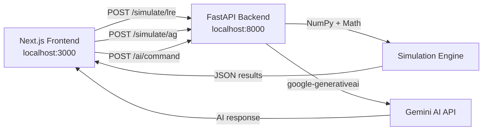

<](https://nextjs.org/)
[](https://fastapi.tiangolo.com/)
[](https://python.org/)
[](https://tailwindcss.com/)
[](LICENSE)

</div>

---

## 📖 Overview

The **Rocket Engine Simulation Lab** is a full-stack web application that lets you design, configure, and simulate rocket engines in real time. It features two distinct operating modes:

| Mode | Description |
|------|-------------|
| **🔧 Traditional LRE** | Design liquid rocket engines using real thermodynamic equations — adjust propellant combinations, chamber pressures, expansion ratios, combustion cycles, and altitude to see how Isp, mass flow rate, and nozzle geometry change instantly. |
| **🌀 Antigravity Research** | Explore theoretical quantum propulsion concepts — tune graviton flux, Casimir vacuum pressure, field intensity, spacetime permittivity, and power sources to model hypothetical lift forces and warp factors. |

An integrated **Google Gemini AI** assistant acts as a senior propulsion engineer, offering real-time design optimizations, material recommendations, and safety checklists.

---

## ✨ Key Features

### Highly Customizable Design Parameters

**Traditional LRE Mode:**
- **Propellant Selection** — LOX/RP-1, LH2/LOX, CH4/LOX, Hydrazine/NTO (each with unique γ, R, and combustion temperatures)
- **Combustion Cycle** — Gas Generator vs. Staged Combustion (with Isp efficiency penalties)
- **Target Thrust** — 100 N to 5,000 N
- **Chamber Pressure** — 10 to 150 Bar
- **Expansion Ratio** — 2 to 100
- **Altitude** — 0 m (sea level) to 50,000 m (near-vacuum), dynamically altering ambient pressure

**Antigravity Mode:**
- **Field Geometry** — Toroidal, Spherical, or Cylindrical drive configurations
- **Power Source** — Cold Fusion Array or Antimatter Plasma
- **Graviton Flux** — 100 to 2,000 THz
- **Field Intensity** — 0 to 5 Tesla
- **Casimir Pressure** — 0 to 100 nN
- **Spacetime Permittivity** — 0.1 to 2.0

### Real-Time Simulation & Visualization
- Live telemetry charts (thrust trace / graviton flux stability) powered by **Recharts**
- Dynamic SVG engine cross-section that morphs as you adjust the expansion ratio
- Animated quantum core visualizer with field geometry indicators

### AI-Powered Engineering Assistant
- **Design Optimization** — Get 3 targeted improvements for your current configuration
- **Theoretical Materials** — AI-suggested alloys and composites based on thermal/field loads
- **Free-form Chat** — Ask any propulsion engineering question in context

---

## 🏗️ Architecture

```
rocket-engine-lab/
├── backend/                  # Python FastAPI simulation server
│   ├── main.py               # API endpoints & Gemini AI integration
│   ├── models.py             # Pydantic request/response schemas
│   └── simulation.py         # Thermodynamic & theoretical physics engine
│
├── frontend/                 # Next.js 16 dashboard UI
│   └── src/
│       ├── app/
│       │   ├── page.tsx      # Main lab dashboard (client component)
│       │   ├── layout.tsx    # Root layout with fonts
│       │   └── globals.css   # Global styles & custom scrollbar
│       └── lib/
│           └── utils.ts      # Tailwind merge utility
│
├── Google Gemini.pdf         # Original design document & engineering report
├── The-LRE-Engine-Lab.txt    # Original prototype source code
├── .gitignore
└── README.md
```

### How It Works



---

## 🔬 Physics & Equations

### Traditional LRE — De Laval Nozzle Thermodynamics

The backend computes engine performance using standard rocket propulsion equations:

| Parameter | Equation |
|-----------|----------|
| **Characteristic Velocity (c\*)** | `c* = √(R·Tc/γ) × (2/(γ+1))^(-(γ+1)/(2(γ-1)))` |
| **Thrust Coefficient (Cf)** | `Cf = √((2γ²/(γ-1)) × (2/(γ+1))^((γ+1)/(γ-1)) × (1 - (Pa/Pc)^((γ-1)/γ)))` |
| **Specific Impulse (Isp)** | `Isp = (c* × Cf) / g₀` |
| **Mass Flow Rate (ṁ)** | `ṁ = F / (Isp × g₀)` |
| **Throat Area (At)** | `At = (ṁ × c*) / Pc` |
| **Ambient Pressure (Pa)** | Barometric formula: `Pa = 101325 × e^(-g·M·h / (R*·T))` |

> Gas Generator cycle applies a 5% Isp penalty compared to Staged Combustion.

### Antigravity — Theoretical Quantum Fields

| Parameter | Model |
|-----------|-------|
| **Lift Force** | `F_lift = Graviton_Flux × Field_Intensity × 1.5 × geometry_modifier × power_modifier` |
| **Mass Reduction** | `ΔM = min(Intensity × Permittivity × 50 / 100, 99.9%)` |
| **Warp Factor** | `W = log₁₀(Graviton_Flux) × Intensity × (Permittivity / 100)` |

---

## 🛠️ Prerequisites

Before you begin, ensure you have the following installed:

| Tool | Version | Download |
|------|---------|----------|
| **Python** | 3.10+ | [python.org](https://www.python.org/downloads/) |
| **Node.js** | 18+ | [nodejs.org](https://nodejs.org/) |
| **npm** | 9+ | Comes with Node.js |
| **Git** | Latest | [git-scm.com](https://git-scm.com/) |

**Optional:**
- A [Google Gemini API Key](https://aistudio.google.com/apikey) — required only for the AI assistant features (design optimization, materials advisor, chat). The simulation itself works without it.

---

## ⚡ Quick Start

### 1. Clone the Repository

```bash
git clone https://github.com/Souvik-Ghost/rocket-engine-lab.git
cd rocket-engine-lab
```

### 2. Set Up the Python Backend

```bash
# Navigate to backend
cd backend

# Create a virtual environment
python -m venv venv

# Activate the virtual environment
# Windows (PowerShell):
.\venv\Scripts\activate
# macOS / Linux:
source venv/bin/activate

# Install dependencies
pip install fastapi uvicorn pydantic numpy google-generativeai

# Start the API server
python main.py
```

The backend will start on **http://localhost:8000**.  
You can explore the auto-generated API docs at **http://localhost:8000/docs**.

### 3. Set Up the Next.js Frontend

Open a **new terminal** window:

```bash
# Navigate to frontend
cd frontend

# Install dependencies
npm install

# Start the development server
npm run dev
```

The frontend will start on **http://localhost:3000**.

### 4. Open in Browser

Navigate to **http://localhost:3000** — the simulation lab is ready to use!

---

## 🎮 Usage Guide

### Switching Modes
Use the **Traditional / Antigravity** toggle at the top of the sidebar to switch between the two simulation engines. The entire UI — colors, parameters, charts, and visualizer — adapts dynamically.

### Adjusting Parameters
- Use the **dropdown selectors** to pick propellant types, combustion cycles, field geometries, and power sources.
- Drag the **sliders** to adjust continuous parameters (thrust, pressure, altitude, flux, intensity, etc.).
- The simulation **auto-recalculates** on every parameter change — no need to press a button.

### Reading Results
- The **header bar** displays key computed metrics (Isp, Mass Flow, Throat/Exit Radius for LRE; Lift Force, Mass Reduction, Warp Factor for AG).
- The **Thrust Trace / Graviton Flux Stability** chart shows a simulated telemetry feed.
- The **Engine Cross-Section / Gravitational Core** visualizer updates its geometry in real time.

### Using the AI Assistant
1. Paste your **Google Gemini API Key** into the input field at the top of the sidebar.
2. Click **✨ Optimize Core** for 3 targeted design improvements.
3. Click **✨ Theoretical Materials** for material/alloy recommendations.
4. Type any question in the **chat input** at the bottom and press Enter.

---

## 📡 API Reference

All endpoints are served from `http://localhost:8000`.

### `POST /simulate/lre`

Compute traditional liquid rocket engine performance.

**Request Body:**
```json
{
  "propellant": "LOX/RP-1",
  "target_thrust_N": 500,
  "chamber_pressure_bar": 20,
  "expansion_ratio": 12,
  "combustion_cycle": "staged_combustion",
  "altitude_m": 0
}
```

**Response:**
```json
{
  "isp": 287.4,
  "mass_flow": 0.177,
  "throat_radius_mm": 12.35,
  "exit_radius_mm": 42.78,
  "efficiency": 63.9,
  "sim_data": [{"time": 0.0, "val1": 499.12, "val2": 20.34}, ...]
}
```

### `POST /simulate/ag`

Compute theoretical antigravity propulsion parameters.

**Request Body:**
```json
{
  "field_geometry": "toroidal",
  "graviton_flux_thz": 450,
  "field_intensity_t": 0.85,
  "casimir_pressure_nn": 12.5,
  "spacetime_permittivity": 1.0,
  "power_source": "cold_fusion"
}
```

**Response:**
```json
{
  "lift_kn": 688.50,
  "mass_reduction_pct": 0.4,
  "warp_factor": 0.023,
  "power_draw_kw": 1250,
  "efficiency": 0.9,
  "sim_data": [{"time": 0.0, "val1": 449.21, "val2": 84.72}, ...]
}
```

### `POST /ai/command`

Send a command or chat message to the Gemini AI assistant.

**Request Body:**
```json
{
  "mode": "Traditional",
  "command": "optimize",
  "context": "Thrust 500N, Pc 20bar, Propellant LOX/RP-1",
  "message": null,
  "apiKey": "YOUR_GEMINI_API_KEY"
}
```

---

## 🧰 Tech Stack

| Layer | Technology | Purpose |
|-------|------------|---------|
| **Frontend** | Next.js 16 (App Router) | React framework with server components |
| **Styling** | Tailwind CSS 4 | Utility-first CSS with dynamic theming |
| **Charts** | Recharts 3 | Responsive area/line charts for telemetry |
| **Icons** | Lucide React | Consistent icon system |
| **Backend** | FastAPI | High-performance async Python API |
| **Math** | NumPy | Numerical simulation & noise generation |
| **AI** | Google Gemini 2.5 Flash | Design optimization & engineering chat |
| **Validation** | Pydantic | Request/response schema validation |

---

## 🤝 Contributing

Contributions are welcome! Feel free to:

1. Fork the repository
2. Create a feature branch (`git checkout -b feature/new-propellant`)
3. Commit your changes (`git commit -m 'Add N2O4/UDMH propellant support'`)
4. Push to the branch (`git push origin feature/new-propellant`)
5. Open a Pull Request

---

## 📄 License

This project is open source and available under the [MIT License](LICENSE).

---

<div align="center">
  
**Built with 🔥 by [Souvik-Ghost](https://github.com/Souvik-Ghost)**

*From physical jet engine experiments to digital propulsion simulations.*

</div>
]]>
